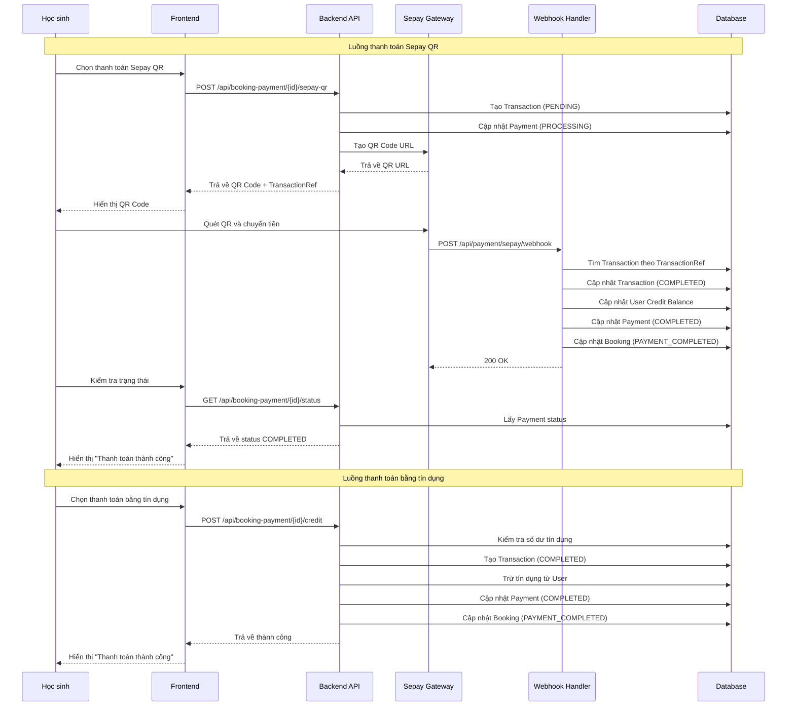
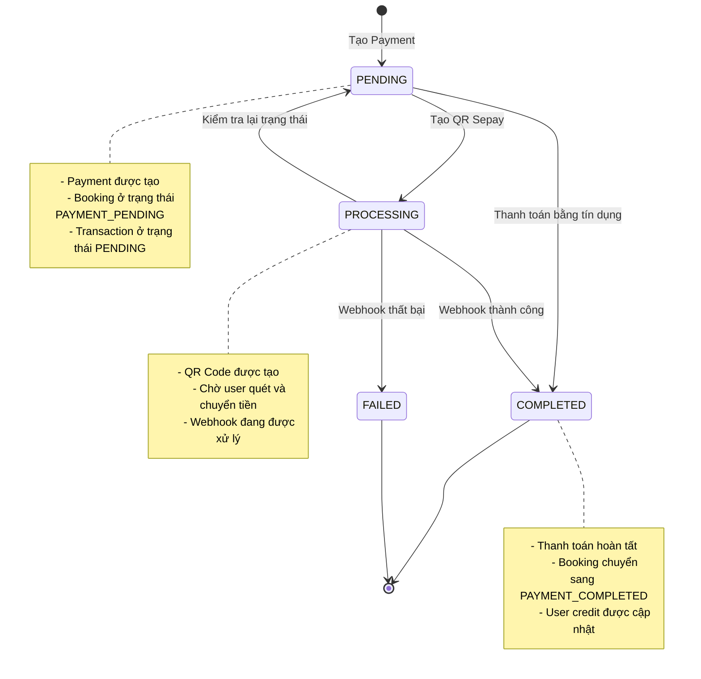

# Luồng thanh toán Booking với Sepay

## Sequence Diagram



## State Diagram



## Webhook Processing Logic

```mermaid
flowchart TD
    A[Sepay Webhook] --> B[Parse JSON Payload]
    B --> C[Extract TransactionRef]
    C --> D{Tìm Transaction}
    D -->|Tìm thấy| E[Kiểm tra Status]
    D -->|Không tìm thấy| F[Tìm theo Amount + Time]
    F --> G{Tìm thấy?}
    G -->|Có| E
    G -->|Không| H[Trả về Error]

    E --> I{Transaction đã COMPLETED?}
    I -->|Có| J[Trả về "Already completed"]
    I -->|Không| K[Kiểm tra Webhook Status]

    K --> L{Status = SUCCESS?}
    L -->|Có| M[Kiểm tra Transaction Type]
    L -->|Không| N[Cập nhật FAILED]

    M --> O{Type = DEPOSIT?}
    O -->|Có| P[Cộng tiền vào tài khoản]
    O -->|Không| Q[Trừ tiền từ tài khoản]

    P --> R[Cập nhật Transaction COMPLETED]
    Q --> S[Cập nhật Payment COMPLETED]
    S --> T[Cập nhật Booking PAYMENT_COMPLETED]
    R --> U[Trả về Success]
    T --> U
    N --> U
```

## API Endpoints Summary

| Method | Endpoint                                     | Mô tả                          |
| ------ | -------------------------------------------- | ------------------------------ |
| POST   | `/api/booking-payment/{id}/sepay-qr`         | Tạo QR thanh toán Sepay        |
| GET    | `/api/booking-payment/{id}/status`           | Kiểm tra trạng thái thanh toán |
| POST   | `/api/booking-payment/{id}/credit`           | Thanh toán bằng tín dụng       |
| POST   | `/api/booking-payment/{id}/simulate-success` | Mô phỏng thanh toán thành công |
| POST   | `/api/payment/sepay/webhook`                 | Webhook từ Sepay               |

## Database Schema Updates

### Transaction Table

```sql
-- Thêm các trường mới
ALTER TABLE transactions ADD COLUMN payment_id INTEGER;
ALTER TABLE transactions ADD COLUMN booking_id INTEGER;
ALTER TABLE transactions ADD COLUMN balance_before DECIMAL(10,2);
ALTER TABLE transactions ADD COLUMN balance_after DECIMAL(10,2);

-- Foreign keys
ALTER TABLE transactions ADD CONSTRAINT fk_transaction_payment
    FOREIGN KEY (payment_id) REFERENCES payments(id);
ALTER TABLE transactions ADD CONSTRAINT fk_transaction_booking
    FOREIGN KEY (booking_id) REFERENCES bookings(id);
```

### Payment Table

```sql
-- Thêm các trường cho Sepay
ALTER TABLE payments ADD COLUMN sepay_order_id VARCHAR(255);
ALTER TABLE payments ADD COLUMN qr_code_url VARCHAR(500);
ALTER TABLE payments ADD COLUMN gateway_response TEXT;
```

## Error Handling

### Common Error Scenarios

1. **Payment not found**: Booking không có payment record
2. **Insufficient credit**: Không đủ tín dụng để thanh toán
3. **Invalid booking status**: Booking không ở trạng thái PAYMENT_PENDING
4. **Webhook amount mismatch**: Số tiền trong webhook không khớp
5. **Transaction already completed**: Giao dịch đã được xử lý

### Error Response Format

```json
{
  "success": false,
  "message": "Mô tả lỗi chi tiết",
  "errorCode": "ERROR_CODE",
  "timestamp": "2025-10-18T10:30:00Z"
}
```

## Security Considerations

1. **Authentication**: Tất cả API đều yêu cầu JWT token
2. **Authorization**: Kiểm tra quyền sở hữu booking
3. **Webhook Validation**: Verify signature từ Sepay (optional)
4. **Amount Verification**: Kiểm tra số tiền trong webhook
5. **Idempotency**: Xử lý webhook trùng lặp

## Performance Considerations

1. **Database Indexes**: Index trên transaction_ref, payment_id, booking_id
2. **Webhook Processing**: Xử lý webhook nhanh để tránh timeout
3. **Status Polling**: Frontend polling với interval hợp lý
4. **Caching**: Cache payment status nếu cần thiết

## Monitoring & Logging

1. **Webhook Logs**: Log tất cả webhook requests
2. **Transaction Logs**: Log mọi thay đổi transaction status
3. **Error Tracking**: Track và alert các lỗi quan trọng
4. **Metrics**: Monitor success rate, response time

