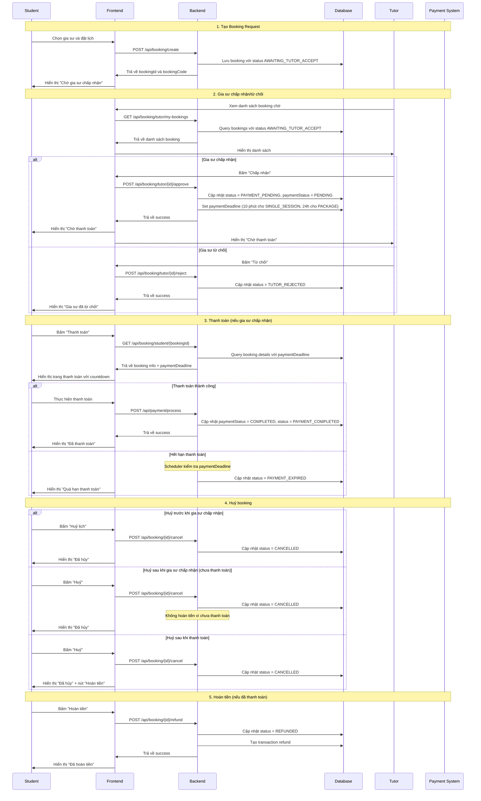
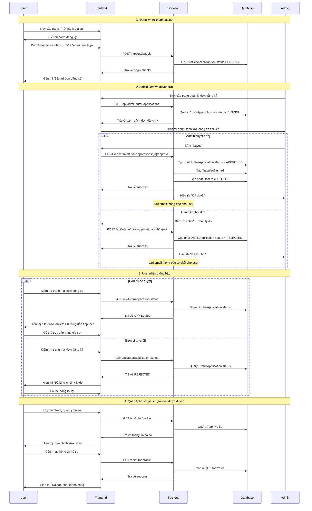
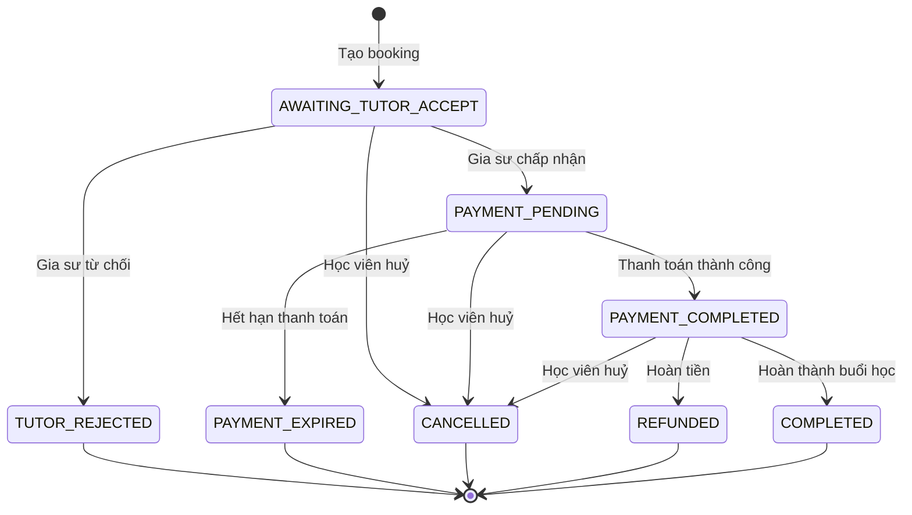
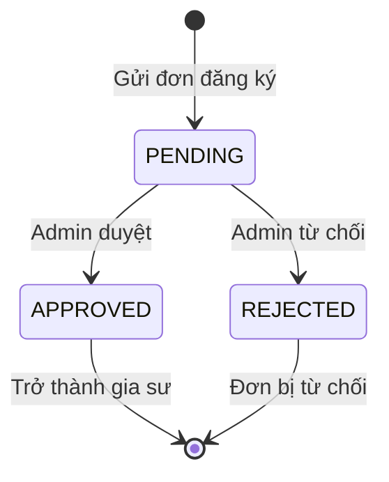

# Sơ đồ luồng Booking

## Luồng Booking chính

```mermaid
sequenceDiagram
    participant S as Student
    participant F as Frontend
    participant B as Backend
    participant DB as Database
    participant T as Tutor
    participant P as Payment System

    Note over S,P: 1. Tạo Booking Request
    S->>F: Chọn gia sư và đặt lịch
    F->>B: POST /api/booking/create
    B->>DB: Lưu booking với status AWAITING_TUTOR_ACCEPT
    B->>F: Trả về bookingId và bookingCode
    F->>S: Hiển thị "Chờ gia sư chấp nhận"

    Note over S,P: 2. Gia sư chấp nhận/từ chối
    T->>F: Xem danh sách booking chờ
    F->>B: GET /api/booking/tutor/my-bookings
    B->>DB: Query bookings với status AWAITING_TUTOR_ACCEPT
    B->>F: Trả về danh sách booking
    F->>T: Hiển thị danh sách

    alt Gia sư chấp nhận
        T->>F: Bấm "Chấp nhận"
        F->>B: POST /api/booking/tutor/{id}/approve
        B->>DB: Cập nhật status = PAYMENT_PENDING, paymentStatus = PENDING
        B->>DB: Set paymentDeadline (10 phút cho SINGLE_SESSION, 24h cho PACKAGE)
        B->>F: Trả về success
        F->>S: Hiển thị "Chờ thanh toán"
        F->>T: Hiển thị "Chờ thanh toán"
    else Gia sư từ chối
        T->>F: Bấm "Từ chối"
        F->>B: POST /api/booking/tutor/{id}/reject
        B->>DB: Cập nhật status = TUTOR_REJECTED
        B->>F: Trả về success
        F->>S: Hiển thị "Gia sư đã từ chối"
    end

    Note over S,P: 3. Thanh toán (nếu gia sư chấp nhận)
    S->>F: Bấm "Thanh toán"
    F->>B: GET /api/booking/student/{bookingId}
    B->>DB: Query booking details với paymentDeadline
    B->>F: Trả về booking info + paymentDeadline
    F->>S: Hiển thị trang thanh toán với countdown

    alt Thanh toán thành công
        S->>F: Thực hiện thanh toán
        F->>B: POST /api/payment/process
        B->>DB: Cập nhật paymentStatus = COMPLETED, status = PAYMENT_COMPLETED
        B->>F: Trả về success
        F->>S: Hiển thị "Đã thanh toán"
    else Hết hạn thanh toán
        Note over B: Scheduler kiểm tra paymentDeadline
        B->>DB: Cập nhật status = PAYMENT_EXPIRED
        F->>S: Hiển thị "Quá hạn thanh toán"
    end

    Note over S,P: 4. Huỷ booking
    alt Huỷ trước khi gia sư chấp nhận
        S->>F: Bấm "Huỷ lịch"
        F->>B: POST /api/booking/{id}/cancel
        B->>DB: Cập nhật status = CANCELLED
        F->>S: Hiển thị "Đã hủy"
    else Huỷ sau khi gia sư chấp nhận (chưa thanh toán)
        S->>F: Bấm "Huỷ"
        F->>B: POST /api/booking/{id}/cancel
        B->>DB: Cập nhật status = CANCELLED
        Note over B: Không hoàn tiền vì chưa thanh toán
        F->>S: Hiển thị "Đã hủy"
    else Huỷ sau khi thanh toán
        S->>F: Bấm "Huỷ"
        F->>B: POST /api/booking/{id}/cancel
        B->>DB: Cập nhật status = CANCELLED
        F->>S: Hiển thị "Đã hủy" + nút "Hoàn tiền"
    end

    Note over S,P: 5. Hoàn tiền (nếu đã thanh toán)
    S->>F: Bấm "Hoàn tiền"
    F->>B: POST /api/booking/{id}/refund
    B->>DB: Cập nhật status = REFUNDED
    B->>DB: Tạo transaction refund
    B->>F: Trả về success
    F->>S: Hiển thị "Đã hoàn tiền"
```

## Luồng Become Tutor

```mermaid
sequenceDiagram
    participant U as User
    participant F as Frontend
    participant B as Backend
    participant DB as Database
    participant A as Admin

    Note over U,A: 1. Đăng ký trở thành gia sư
    U->>F: Truy cập trang "Trở thành gia sư"
    F->>U: Hiển thị form đăng ký
    U->>F: Điền thông tin cá nhân + CV + Video giới thiệu
    F->>B: POST /api/tutor/apply
    B->>DB: Lưu ProfileApplication với status PENDING
    B->>F: Trả về applicationId
    F->>U: Hiển thị "Đã gửi đơn đăng ký"

    Note over U,A: 2. Admin xem và duyệt đơn
    A->>F: Truy cập trang quản lý đơn đăng ký
    F->>B: GET /api/admin/tutor-applications
    B->>DB: Query ProfileApplication với status PENDING
    B->>F: Trả về danh sách đơn đăng ký
    F->>A: Hiển thị danh sách với thông tin chi tiết

    alt Admin duyệt đơn
        A->>F: Bấm "Duyệt"
        F->>B: POST /api/admin/tutor-applications/{id}/approve
        B->>DB: Cập nhật ProfileApplication status = APPROVED
        B->>DB: Tạo TutorProfile mới
        B->>DB: Cập nhật User role = TUTOR
        B->>F: Trả về success
        F->>A: Hiển thị "Đã duyệt"
        Note over B: Gửi email thông báo cho user
    else Admin từ chối đơn
        A->>F: Bấm "Từ chối" + nhập lý do
        F->>B: POST /api/admin/tutor-applications/{id}/reject
        B->>DB: Cập nhật ProfileApplication status = REJECTED
        B->>F: Trả về success
        F->>A: Hiển thị "Đã từ chối"
        Note over B: Gửi email thông báo từ chối cho user
    end

    Note over U,A: 3. User nhận thông báo
    alt Đơn được duyệt
        U->>F: Kiểm tra trạng thái đơn đăng ký
        F->>B: GET /api/tutor/application-status
        B->>DB: Query ProfileApplication status
        B->>F: Trả về APPROVED
        F->>U: Hiển thị "Đã được duyệt" + hướng dẫn tiếp theo
        U->>F: Có thể truy cập trang gia sư
    else Đơn bị từ chối
        U->>F: Kiểm tra trạng thái đơn đăng ký
        F->>B: GET /api/tutor/application-status
        B->>DB: Query ProfileApplication status
        B->>F: Trả về REJECTED
        F->>U: Hiển thị "Đã bị từ chối" + lý do
        U->>F: Có thể đăng ký lại
    end

    Note over U,A: 4. Quản lý hồ sơ gia sư (sau khi được duyệt)
    U->>F: Truy cập trang quản lý hồ sơ
    F->>B: GET /api/tutor/profile
    B->>DB: Query TutorProfile
    B->>F: Trả về thông tin hồ sơ
    F->>U: Hiển thị form chỉnh sửa hồ sơ

    U->>F: Cập nhật thông tin hồ sơ
    F->>B: PUT /api/tutor/profile
    B->>DB: Cập nhật TutorProfile
    B->>F: Trả về success
    F->>U: Hiển thị "Đã cập nhật thành công"
```

## Trạng thái Booking

```mermaid
stateDiagram-v2
    [*] --> AWAITING_TUTOR_ACCEPT: Tạo booking

    AWAITING_TUTOR_ACCEPT --> TUTOR_REJECTED: Gia sư từ chối
    AWAITING_TUTOR_ACCEPT --> PAYMENT_PENDING: Gia sư chấp nhận
    AWAITING_TUTOR_ACCEPT --> CANCELLED: Học viên huỷ

    PAYMENT_PENDING --> PAYMENT_COMPLETED: Thanh toán thành công
    PAYMENT_PENDING --> PAYMENT_EXPIRED: Hết hạn thanh toán
    PAYMENT_PENDING --> CANCELLED: Học viên huỷ

    PAYMENT_COMPLETED --> COMPLETED: Hoàn thành buổi học
    PAYMENT_COMPLETED --> CANCELLED: Học viên huỷ
    PAYMENT_COMPLETED --> REFUNDED: Hoàn tiền

    TUTOR_REJECTED --> [*]
    PAYMENT_EXPIRED --> [*]
    CANCELLED --> [*]
    REFUNDED --> [*]
    COMPLETED --> [*]
```

## Trạng thái Tutor Application

```mermaid
stateDiagram-v2
    [*] --> PENDING: Gửi đơn đăng ký

    PENDING --> APPROVED: Admin duyệt
    PENDING --> REJECTED: Admin từ chối

    APPROVED --> [*]: Trở thành gia sư
    REJECTED --> [*]: Đơn bị từ chối
```
